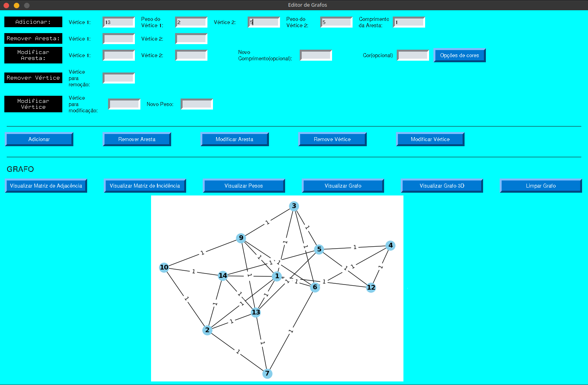

<h1 align="center">Editor de Grafos</h1>
Editor de Grafos

<i>Um software para auxiliar na plotagem, na edição e na visualização de grafos, 
é possivel visualizar os grafos inseridos, bem como suas matrizes, matriz de 
incidência e matriz de adjacência.</i>

<h2>Features</h2>

<li> Adicionar vértices ao grafo</li>
<li> Remover vértice do grafo </li>
<li> Modificar peso de vértices</li>
<li> Remover arestas do grafo</li>
<li> Modificar comprimento de arestas</li>
<li> Visualizar matriz de adjacência</li>
<li> Visualizar matriz de incidência</li>
<li> Visualizar pesos dos vértices</li>
<li> Limpar o grafo</li>
<li> Visualizar o grafo em uma janela separada para ter mais controle sobre o mesmo. </li>
<i>OBS.: Nessa janela é possivel dar zoom e movimentar-se sobre o grafo.</i>

<h2>Pré-requisitos e como rodar</h2>

 Antes de começar, é preciso ter instalado em sua máquina as seguintes ferramentas:

<li>Python 3</li>

<i> Instale o python 3 e se for preciso torne o python e gerenciador de de pacotes pip variaveis de ambiente</i>
<i> intalar o python na maioria das vezes o sistema operacional ja o torna variavel de ambiente logo este passo pode ser pulado.</i>

 Abra o diretorio do programa, onde está o codigo fonte, inicialize o terminal nesse diretorio.

Execute no terminal os seguintes comandos para importar as bibliotecas utilizadas no projeto :

<li>pip install networkx</li>
<li>pip install numpy</li>
<li>pip install PySimpleGUI</li>
<li>pip install matplotlib</li>
<li>pip install plotly</li>
<li>pip install io</li>
<li>pip install PIL</li>
 

 Após instalar as bibliotecas execute o seguinte comando no diretorio do programa (ou clique duas vezes sobre o arquivo Interface.py):

<li> python Interface.py</li>

### 🛠 Tecnologias

<li>[Python 3] (https://www.python.org/)</li>
<li>[PyCharm] (https://www.jetbrains.com/pt-br/pycharm/)</li>

# Blibliotecas do Python utilizadas:

<li> networkx </li>
<li> numpy </li>
<li> PySimpleGUI</li>
<li> matplotlib</li>
<li> plotly</li>
<li> io </li> 
<li> PIL </li>

 
